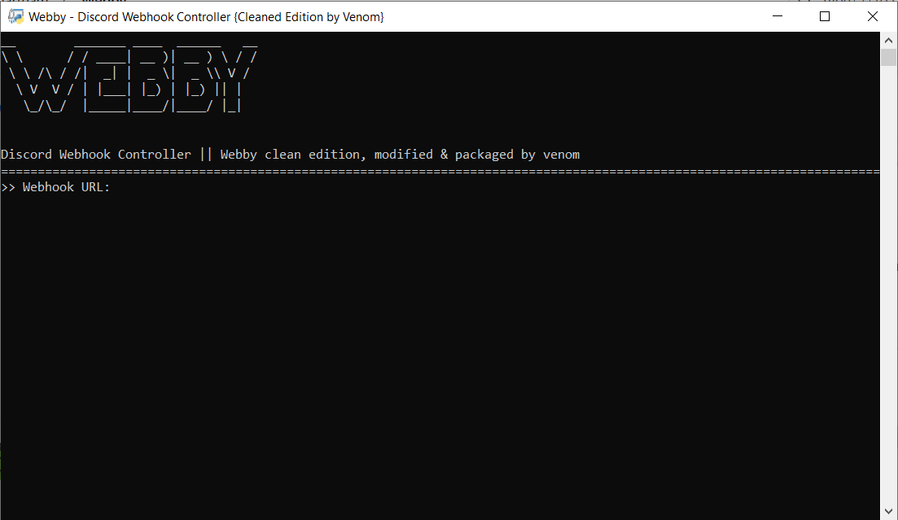

# Webby ======
Webby is a discord webhook controller created by certifiedfish101. If you can find the link to a webhook, you can have full control over what it says or does... easy!
This version, Webby Clean Edition, is a project I made that cleans up the code of Webby, tweaks the UI, and fixes bugs. It is the definitive version of webby as of now, and is made by Venom.

# Preview ======


# Terms of Use ======
This project is licensed under the GNU General Public License v3.0
```js
Webby is made for educational purposes only and is not created for malicious purposes.
Any damage done with this software, or any breaking of discords ToS, is not at the fault of Soupcan7 or at the fault of Lunar Team.
It is only at fault of the user.
```
